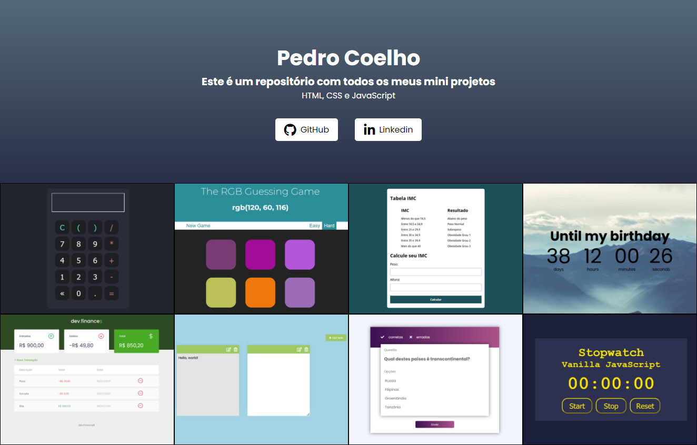

 # Bem-vindo! 👋

Este é um repositório em que estarei colocando todos os meus mini projetos.  
[Clique aqui](https://pedrocoelho-projects.vercel.app/) para acessar a página com todos os projetos

 ## **Projetos**
 * Calculadora  
Calculadora simples.

 * Calculadora IMC  
Calculadora básica para medir IMC. 

* Card Product    
Card responsivo de um produto para ecommerce.

* dev.Finances  
Mini sistema financeiro com HTML, CSS e JS. Projeto baseado na maratona discover da Rocketseat.

* Stopwatch  
Timer com botões de iniciar, pausar e zerar.

* The RGB Guessing Game    
Jogo de adivinhação - Um codigo RGB aleatório é gerado e o jogador precisa acertar entre as opções disponíveis qual a cor correspondente. [Clique Aqui](https://pedrocoelho-projects.vercel.app/TheRGBgame/index.html) para jogar.

* Countdown Timer  
Página com uma contagem regressiva para uma determinada data.

* GitHub Profile  
Página para pesquisar usuários do github utilizando api.

* Notes App  
Um app de notas. É possível deletar e criar notas novas, além de ficarem salvas no localStorage.

* Quiz App  
Um jogo de perguntas e respostas.

* ToDo App  
App para criar uma lista de tarefas. Nele é possível adicionar e remover tarefas existentes, marcar como completada ao clicar em cima de uma tarefa. Também foi utilizado localStorage para salvar as informações.

 * Urna Eletrônica  
Projeto de uma urna para votos em vereador e prefeito. Como em uma urna comum é possível votar em branco, corrigir e confirmar o voto. Projeto feito acompanhando o vídeo do professor Bonieky Lacerda da B7Web.

 * Weather App  
Projeto de clima de cidades utilizando a api do https://openweathermap.org/.
